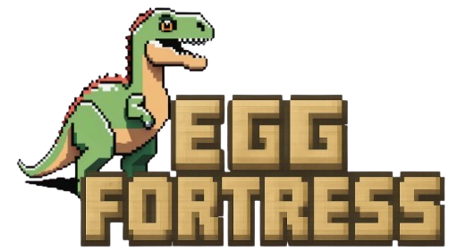

<p align="center">
  
</p>

 

### Description
Egg Fortress est un jeu vidéo réalisé en Python avec la bibliothèque PyGame dans le cadre d'un projet universitaire de 3ème année.

Réalisé par Matheis Fardel, Corentin Deldalle, Nadir ElMoutaouakil, Luc Telliez, Louis Prévost

### Comment jouer
**Compatible Linux, macOS et Windows**
1. Assurez-vous d'avoir Python 3.7+ et Pygame installés
2. Clonez ou téléchargez le projet
3. Naviguez dans le dossier du projet
4. Exécutez le fichier main.py pour commencer à jouer 

### Contrôles

- **Clic gauche** : Sélectionner un dinosaure ou une destination/cible
- **Boutons UI** : Spawner des dinosaures ou placer des pièges
- **ESPACE** : Terminer votre tour
- **ÉCHAP** : Accéder au menu de réglages, etc.

### Fonctionnalités

- **Système de tour par tour** : Chaque joueur joue à son tour
- **Mode IA** : Affrontez une IA intelligente utilisant l'algorithme Minimax
- **Trois types de dinosaures** :
  - Type 1 (40 steaks) : Rapide, faible en vie, attaque moyenne
  - Type 2 (80 steaks) : Équilibré en vitesse, vie et attaque
  - Type 3 (100 steaks) : Lent, forte vie, attaque puissante
- **Système de ressources** : Gagnez 20 steaks par tour et des bonus en tuant des ennemis
- **Pièges** : Placez des pièges pour endommager les dinosaures ennemis
- **Différentes cartes** : Jouez sur plusieurs cartes dans des biomes différents
- **Barres de vie** : Suivez la santé de vos œufs et dinosaures

### Affichage
- **Cases bleues** : Mouvements possibles pour le dinosaure sélectionné
- **Bouton rouge "ATTAQUE"** : Apparaît quand des ennemis sont adjacents
- **Clic sur bouton → Mode attaque** : Cases rouges sur les cibles possibles
- **Clic sur cible rouge** : Attaquer immédiatement

### Règles du jeu

1. Chaque joueur commence avec 100 steaks
2. Gagnez 20 steaks à chaque tour
3. Spawner des dinosaures près de votre grand œuf (distance max: 3 cases)
4. Déplacez vos dinosaures pour attaquer l'ennemi
5. Attaquez les dinosaures ennemis ou leur œuf directement
6. Protégez votre grand œuf - s'il meurt, vous perdez !
7. Les pièges infligent 50 dégâts et immobilisent pendant 2 tours
8. +20 steaks pour chaque dinosaure ennemi éliminé

### Types de dinosaures

##### Type 1 - Rapide (40 steaks)
- Vie: 60
- Attaque: 30
- Mouvement: 3 cases

##### Type 2 - Équilibré (80 steaks)
- Vie: 80
- Attaque: 45
- Mouvement: 2 cases

##### Type 3 - Tank (100 steaks)
- Vie: 120
- Attaque: 60
- Mouvement: 1 case

### Intelligence Artificielle

L'IA utilise un **algorithme Minimax avec recherche à profondeur 2** :

**Fonctionnement :**
1. **Analyse** : Évalue toutes ses actions possibles (~30-50 par tour)
2. **Anticipation** : Simule les meilleures réponses de l'adversaire
3. **Décision** : Choisit l'action qui maximise son avantage après riposte

**Stratégie :**
- **Offensive** : Avance vers l'œuf ennemi et attaque stratégiquement
- **Défensive** : Protège son propre œuf
- **Adaptative** : Ajuste ses décisions selon l'état du jeu

**Configuration :**
Modifiez la difficulté dans `game.py` :
```python
# IA plus rapide (facile)
self.ai = SearchAI(player=2, max_enemy_responses=5)

# IA plus forte (difficile)
self.ai = SearchAI(player=2, max_enemy_responses=12)
```